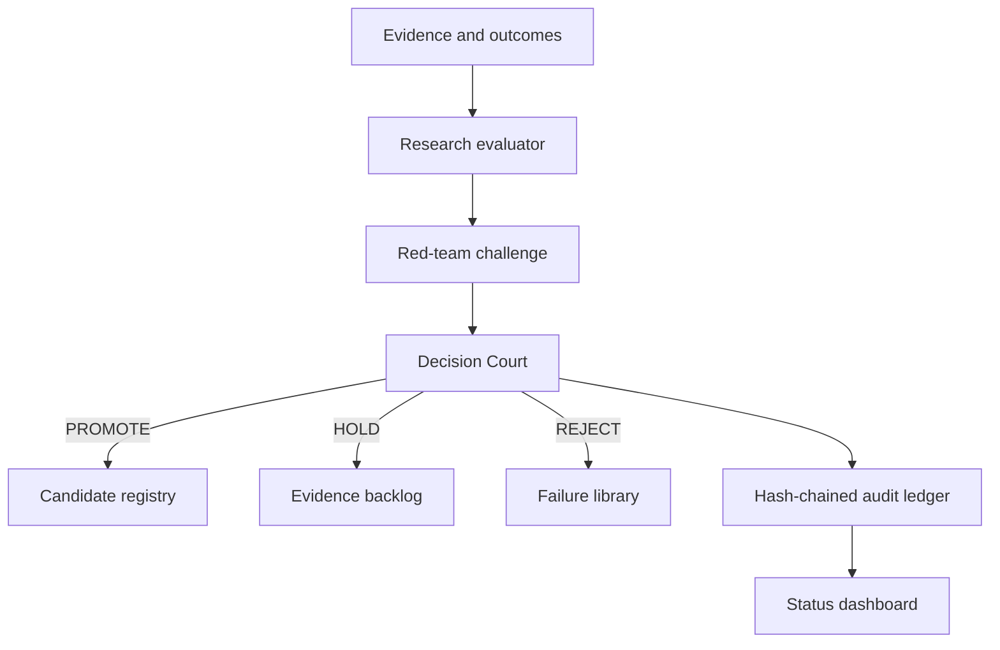

# ATHENA

ATHENA is an evidence-governed, continuously operating quantitative research
organization. It converts research claims and trade outcomes into reproducible
metrics, subjects them to adversarial review, and permits promotion only through
the Decision Court.

This repository is the active public engineering environment. It contains no
private trading data, credentials, Gmail/Drive records, or live brokerage keys.

## Complete engineering freeze

The complete recovered freeze from **8. Trading interfaces – Athena Daily
Progress** is controlled by `config/engineering_freeze.json`. It fixes the
seven-layer architecture, institutional-scale research targets, evidence-first
pipeline, market-mechanics program, specialist organization, 24/7 VPS runtime,
systems of record, TradingView boundary, Mission Control, and human authority.

Run `make freeze` to validate the contract and its implementation mapping. The
current repository implements Phase 0 only; documentation or scaffolding is not
reported as a completed service. See [the complete freeze](docs/ENGINEERING_FREEZE.md)
and [the implementation register](docs/FREEZE_TRACEABILITY.md).

## Current executable slice



The first vertical slice provides:

- deterministic performance metrics from R-multiple outcomes;
- Wilson-score confidence and explicit evidence-weight calculation;
- mandatory counter-evidence, methodology, assumptions, and risk controls;
- a source-eligibility gate that prevents synthetic fixtures from being promoted;
- policy gates for sample size, hit rate, expectancy, profit factor, and drawdown;
- a Decision Court that returns `PROMOTE`, `HOLD`, or `REJECT` with gate-level reasons;
- an append-only SHA-256 hash-chained audit ledger;
- a JSON status contract and browser dashboard;
- unit, policy, tamper-detection, and end-to-end tests;
- hourly and manual GitHub Actions execution.

## Run it

Python 3.11 or later is the only runtime dependency.

```bash
make test
make freeze
make demo
make dashboard
```

Open `http://localhost:8080/dashboard/`. The demonstration uses explicitly
synthetic outcomes in `examples/orb_candidate.json`; it is not trading advice or
proof of a live-market edge.

The equivalent direct command is:

```bash
PYTHONPATH=src python -m athena.cli run examples/orb_candidate.json \
  --ledger runtime/ledger.jsonl \
  --status runtime/status.json
```

## Decision contract

A strategy is never promoted because its headline hit rate looks attractive.
The Court first checks structural completeness and then applies the versioned
policy in `config/decision_policy.json`. Every verdict publishes:

| Field | Meaning |
|---|---|
| Confidence | Wilson lower bound for the observed win rate |
| Evidence weight | Sample, source, and counter-evidence coverage score |
| Sample size | Count of evaluated trade outcomes |
| Expectancy | Mean R-multiple per evaluated trade |
| Risk | Profit factor, maximum drawdown, and declared controls |
| Explanation | Gate-by-gate findings and final rationale |
| Counter-evidence | Recorded facts that weaken or bound the thesis |

## Repository map

```text
src/athena/          Executable kernel and orchestration
config/              Versioned Decision Court policy
examples/            Synthetic reproducible research request
tests/               Contract, metric, ledger, and end-to-end tests
dashboard/           Read-only operational status interface
runtime/             Machine-readable ledger and latest status
docs/                Frozen architecture and governance controls
.github/workflows/   CI, hourly cycle, and dashboard publication
```

## What exists versus what does not

The kernel, audit trail, Court, scheduled runner, and status interface are real
and executable. Market-data connectors, broker execution, portfolio allocation,
LLM research adapters, Gmail/Drive evidence ingestion, walk-forward testing, and
production deployment are deliberately outside this first slice. They must be
added behind the existing contracts and may not weaken the Court.

See [architecture](docs/ARCHITECTURE.md), [governance](docs/GOVERNANCE.md), and
the [delivery plan](docs/ROADMAP.md).
