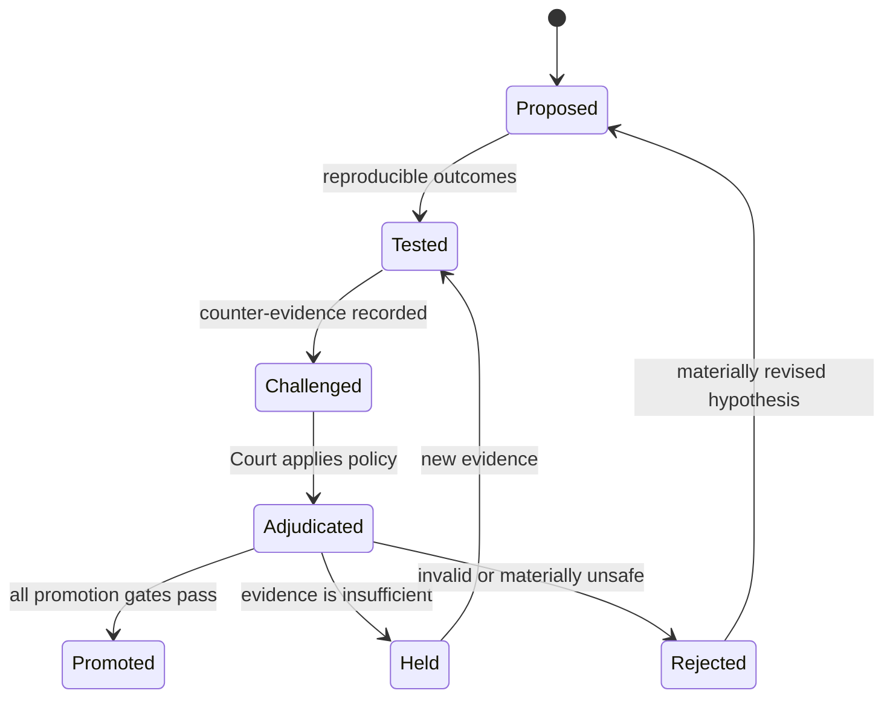

# Frozen architecture

## Objective

ATHENA is a continuously operating quantitative research organization. Its job
is not to manufacture signals. Its job is to discover, challenge, reproduce,
and govern claims about market mechanics while preventing weak evidence from
becoming an approved strategy.

## Kernel principles

- Evidence before opinion.
- Explainable, reproducible, auditable outputs.
- Replaceable implementation modules behind stable contracts.
- No component bypasses the Decision Court.
- No recommendation without confidence, evidence weight, sample size,
  expectancy, risk, explanation, assumptions, and counter-evidence.

## Operating roles

| Role | Authority | Required output | Prohibited action |
|---|---|---|---|
| Evidence Scout | Register source facts and provenance | Evidence references and integrity digest | Interpret a source as proof of a claim |
| Market Mechanic | Form falsifiable causal hypotheses | Claim, mechanism, assumptions, invalidation | Promote a strategy |
| Strategy Engineer | Translate a hypothesis into deterministic rules | Versioned specification and test inputs | Change Court thresholds |
| Test Laboratory | Backtest and later front-test the rules | Reproducible outcomes and methodology | Exclude adverse results silently |
| Red Team | Seek leakage, overfit, regime dependence, and contradictory evidence | Challenges and counter-evidence | Suppress a favourable result without reasons |
| Risk Officer | Quantify loss, drawdown, exposure, and failure conditions | Enforceable risk controls | Approve execution |
| Decision Court | Apply the versioned policy | Gate results and verdict | Alter evidence or test outputs |
| Memory Custodian | Preserve claims, failures, verdicts, and provenance | Hash-chained audit record | Rewrite history |

Roles are software boundaries, not claims that autonomous agents are already
deployed. The current executable slice implements the Test Laboratory, Red Team
contract, Risk Officer fields, Decision Court, and Memory Custodian.

## State machine

`PROMOTE` means eligible for the next controlled research stage. It never means
permission to place live trades. Live execution requires a separately approved
execution policy, broker controls, capital limits, kill switch, and accountable
human authority.

## Data contracts

An evidence reference has a stable ID, source class, locator, observed time, and
SHA-256 digest. The digest proves content identity only when the referenced bytes
are retained and independently retrievable.

A research request states the claim, mechanism, recommendation, instrument,
timeframe, outcomes, evidence references, counter-evidence, assumptions,
methodology, and risk controls. The evaluator rejects structurally incomplete
requests.

The Court publishes the policy ID, verdict, gate results, metrics, confidence,
evidence weight, risks, counter-evidence, and remediation conditions.
Synthetic fixtures can prove the software path, but the source-eligibility gate
bars them from promotion evidence.

## Audit model

Every cycle appends canonical JSON events to a SHA-256 hash chain. Validation
detects modification, removal, reordering, and insertion after the chain has
been anchored. A local chain is tamper-evident, not independently immutable;
production must anchor terminal hashes outside the write domain.

## 24/7 execution

GitHub Actions invokes the same deterministic CLI used locally. The scheduled
workflow tests the kernel before each cycle, runs the queued research request,
validates the ledger, updates the status contract, and stores an audit artifact.
This establishes continuous orchestration. It does not pretend that ChatGPT is
running continuously.
