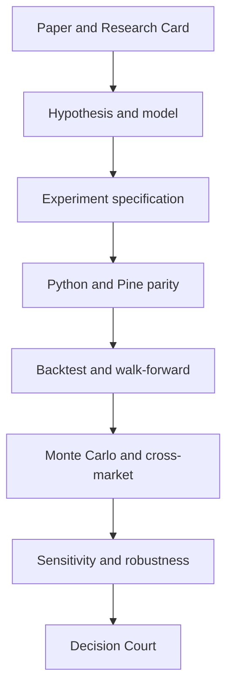

# ATHENA complete engineering freeze

## Control statement

`ATHENA-EF-2026-08-13` is the controlling architecture contract. The machine-
readable source is `config/engineering_freeze.json`; this document explains how
that contract governs delivery. Removing or weakening a frozen component is a
protected change and requires evidence, tests, an explicit proposal, and Owner/CIO
approval.

The executable Knowledge/Evidence increment is controlled by
`config/evidence_registers.json` and [EVIDENCE_FOUNDATION.md](EVIDENCE_FOUNDATION.md).
It implements stable record identity, provenance, dataset fingerprints, and
register-ledger reconciliation without claiming that the research corpus or
production systems of record are complete. [EF-002, EF-009, EF-010]

The recovered evidence register is deliberately honest about its limit: the
public repository does not contain a complete export of the original Project
conversation. Requirements recovered from the indexed history are integrated.
Details not recovered are listed as unresolved and may not be invented.

## Objective and scale

ATHENA is an institutional-grade, asset-agnostic, continuously operating
quantitative research organization. It must discover repeatable market mechanics,
turn research evidence into governed trading decisions, learn from completed
experiments and trades, and report its operational state. [EF-002, EF-004, EF-005]

The program targets at least 100 papers, 250 experiments, 50 factors, 20
indicators, and 5 strategies, with an intended strategy range of 5–10. These are
portfolio-scale program targets, not permission to mass-produce unvalidated code.
[EF-002]

## Fixed architecture

The seven layers and their order are fixed. [EF-001]

| Layer | Controlled responsibility |
|---|---|
| Knowledge | Sources, Research Cards, bibliography, and permanent learning |
| Evidence | Variables, hypotheses, formulas, provenance, and research questions |
| Research | Falsifiable mathematical models and one-variable experiments |
| Market Intelligence | Normalized volatility, trend, momentum, liquidity, state, and regime |
| Decision Engine | Probability, confidence, strategy selection, risk, Skeptic, and Decision Court |
| Execution Engine | Entry, sizing, trade management, and research/paper/live boundaries |
| Validation Engine | Walk-forward, Monte Carlo, cross-market, sensitivity, and robustness controls |

The Core Library remains Math, Statistics, Volatility, Trend, Momentum,
Liquidity, Risk, Visualisation, and Strategy API. Operational workspaces remain
Mission Control, Research Lab, Engineering, Validation Centre, and Trading
Operations. [EF-011, EF-013]

## Evidence-first lifecycle

The required sequence is:

No Pine implementation precedes an approved experiment specification.
Experiments isolate one variable before optimization. Promotion requires unseen
data. Failure at any mandatory validation stage is rejection. Win rate is
reported but remains secondary to expectancy, risk-adjusted performance,
drawdown, robustness, and exposure. [EF-002, EF-010]

## Market-mechanics research program

All comparable scores are normalized to 0–100. The factor families are:

- Volatility: ATR percentile, historical volatility, Parkinson, Garman–Klass,
  Yang–Zhang, and a HAR-RV proxy.
- Trend: ADX, EMA structure, linear-regression slope, Kaufman efficiency ratio,
  and Hurst exponent.
- Momentum: ROC, log returns, MACD, RSI slope, and acceleration.
- Liquidity: relative volume, dollar volume, spread, and session participation.
- Market state: Quiet, Expansion, Trending, and Exhaustion.

Raw ATR is prohibited because it is instrument-dependent. GARCH is deferred
until it can be reproduced faithfully in Pine. [EF-003]

The score weights and APS bands in the machine contract are research baselines,
not accepted trading policy. They require one-variable experiments and complete
validation before promotion. This distinction prevents a prior proposal from
being laundered into an approved live rule.

## Controlled experiment queue

| ID | Experiment | State |
|---|---|---|
| ATH-001 | HAR-RV Proxy | First controlled experiment |
| ATH-002 | ATR Percentile | Queued |
| ATH-003 | Historical Volatility | Queued |
| ATH-004 | ADX | Queued |
| ATH-005 | Linear Regression Slope | Queued |
| ATH-006 | Kaufman Efficiency Ratio | Queued |
| ATH-007 | ROC | Queued |
| ATH-008 | Relative Volume | Queued |
| ATH-009 | Hurst | Queued |
| ATH-010 | Regime Classifier | Queued |

ATH-001 uses daily, weekly, and monthly realised-volatility components represented
by 20-day historical volatility, a 5-day historical-volatility average, a 22-day
historical-volatility average, and ATR percentile. Acceptance requires a
reproducible implementation, Python/Pine parity, walk-forward evidence,
cross-market robustness, and complete documentation. [EF-003]

## Specialist organization and authority

| Service | Trigger | Controlled output |
|---|---|---|
| Research | Hourly | Research Cards with evidence links |
| Feature | New accepted Research Card | Formula, variables, feature specification |
| Experiment | Approved specification | Reproducible results |
| Validation | Completed experiment | Stage findings and reject/submit result |
| Market | Minute schedule | Data, features, state, and regime |
| Decision Court | Qualified opportunity | Governed recommendation or rejection |
| Learning | Completed experiment or trade | Memory and failure-library update |
| Operations Director | Continuous | Health, failure, latency, cost, queue, and backlog controls |

Market State, Strategy Selector, Risk Manager, Evidence Engine, Trade Reviewer,
Market Memory, and Skeptic are required decision capabilities. The Skeptic blocks
unsupported, overfit, or material event-risk recommendations. No specialist can
promote itself, alter the evidence packet, mutate protected policy, or send a
live order. [EF-005, EF-006, EF-013]

## 24/7 runtime

The platform—not ChatGPT—runs continuously. The minimum runtime is an Ubuntu VPS
with 4 CPU, 8 GB RAM, and 100 GB storage. Docker operates the API, research,
validation, PostgreSQL, Redis, MinIO/S3, Grafana, Nginx, and orchestrator
services. GPT is invoked through the OpenAI API as a bounded reasoning worker.
[EF-005, EF-006]

This repository currently contains an hourly GitHub workflow only. That is an
interim control, not proof that the frozen VPS/Docker organization exists.
Production acceptance still requires an approved VPS, health checks, durable
queues, backups, restore evidence, cost controls, and 30 consecutive days of
recoverable paper operation.

## Systems of record

Authority is divided deliberately:

- ChatGPT Work: permanent engineering headquarters and human coordination.
- GitHub: code, configuration, executable specifications, tests, and engineering history.
- Google Drive: authoritative research-document repository and permanent research record.
- Google Sheets: evidence database, experiment tracker, and research dashboard until an approved migration.
- Google Docs: living Research Cards.
- PostgreSQL: runtime knowledge memory and operational state.
- MinIO/S3: runtime object storage for papers, charts, data, and reports.
- TradingView: Pine development, visual verification, comparative backtests,
  alerts, and the controlled trading interface.

The exact Drive folder structure is encoded in the freeze contract. No connector
may copy private research material into this public repository. [EF-009]

## Mission Control

ATHENA Daily Progress runs at approximately 08:00 Africa/Johannesburg and reports
completion, research, experiments, decisions, risks, and milestones. Mission
Control also exposes failures, latency, API health, database health, GPT cost,
queue depth, and backlog. [EF-012, EF-006]

The existing public dashboard exposes only the current Phase 0 Court result and
ledger state. It is therefore partial, not the complete Mission Control.

## Authority, accountability, and remedy

The Owner/CIO alone approves protected architecture or policy changes and any
future transition to live execution. Live execution remains prohibited. A
component that lacks its required evidence, validation, infrastructure, or human
approval must report `HOLD`, `REJECT`, `PENDING`, or `BLOCKED_EXTERNAL`; it may
not report itself complete.

Run `athena freeze-status` and `make test` before every freeze-related pull
request. The status output does not measure aspiration; it validates the frozen
contract and its implementation mapping.

## Unresolved—not silently decided

The recovered freeze does not establish the market-data vendor, broker, exact
instrument universe, history window, numeric validation parameters, production
risk limits, VPS provider, domain, SLO, RPO, RTO, or operating budgets. Those
items require separate evidence-backed proposals and Owner/CIO approval.
